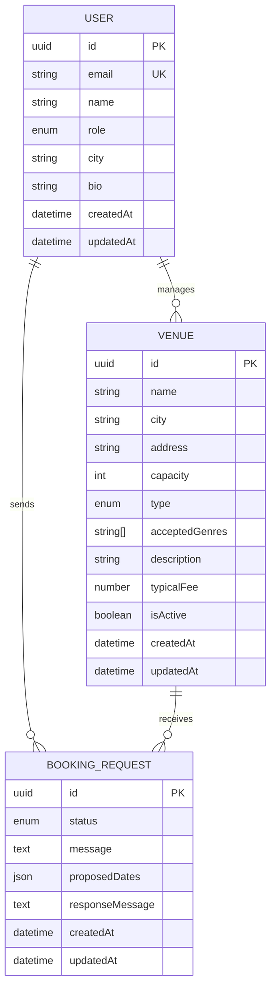

# Connectour API — Module Booking Request

## Status

**MVP**
- Architecture de base ✅
- Configuration ORM (MikroORM v6) ✅
- Entités métier (User, Venue, BookingRequest) ✅
- Endpoints REST (Venues, BookingRequests, Users) ✅
- Docker Compose (PostgreSQL) ✅
- Validation des entrées (DTOs) ✅
- Authentification JWT ✅
- Guards par rôle ✅
- Tests unitaires (Venue, BookingRequest, Auth) ✅
- Déploiement (Dockerfile + stratégie Azure) ✅

---

## Contexte métier

Connectour est une plateforme de mise en relation entre artistes, salles de
concert, tourneurs et organisateurs, née d'un besoin collectif identifié au
sein de la scène des musiques extrêmes (metal, punk, hardcore) de Nantes.

Ce dépôt contient le **module backend Booking Request** : le cœur fonctionnel
de la plateforme, qui permet à un artiste de rechercher des salles selon ses
critères (localisation, capacité, genre musical, période), d'envoyer des
demandes de contact — unitaires ou groupées — et de suivre leur statut jusqu'à
la confirmation ou le refus d'une date.

**Problème métier adressé :**
Aujourd'hui, un artiste peut passer plusieurs heures par semaine à chercher des contacts
sur les réseaux sociaux, envoyer des dizaines de mails sans réponse, et gèrer
les retours de façon chaotique dans sa boîte mail. Ce module vise à ramener
ce temps à moins d'une heure, en centralisant l'ensemble du processus.

**Utilisateurs cibles :**
- Artistes indépendants cherchant à organiser des tournées
- Gestionnaires de salle recevant et traitant les demandes
- Organisateurs bénévoles coordonnant des événements

**Périmètre de ce module (MVP) :**

Ce module couvre :
- La modélisation des entités métier (User, Venue, BookingRequest)
- La recherche filtrée de salles (ville, capacité, genre, période)
- La création de demandes unitaires et groupées
- Le suivi du statut via une machine à états métier
- L'authentification JWT et le contrôle d'accès par rôle
- La documentation des endpoints via Swagger

Ce module ne couvre pas (itérations prévues) :
- Le SSO externe (Google / Azure Entra) et la gestion avancée des sessions
- La messagerie intégrée entre artistes et salles
- Les notifications automatiques et relances
- La génération de contrats et la signature électronique

---

## Décisions techniques

### NestJS + TypeScript
NestJS s'impose naturellement dans ce contexte : cohérence avec le frontend
React/TypeScript existant, architecture modulaire qui reflète le découpage
métier (un module = un domaine), et écosystème mature bien documenté.
L'utilisation de TypeScript garantit la détection d'erreurs à la compilation
et facilite la collaboration future avec l'équipe.

### MikroORM
Choix motivé par trois raisons complémentaires :
- **Migrations plus robustes** que TypeORM, avec un historique versionné clair
- **Pattern Unit of Work** : les changements sont trackés et persistés en une
  seule transaction, ce qui évite les effets de bord
- **Meilleure DX** : `defineConfig` typé, détection d'erreurs à la config

### PostgreSQL
Base relationnelle adaptée aux relations entre entités (User ↔ Venue ↔
BookingRequest). Le type `jsonb` natif est utilisé pour les `proposedDates`,
ce qui évite une table de jointure supplémentaire pour un besoin simple.

### crypto.randomUUID() natif
Plutôt que d'ajouter une dépendance `uuid`, on utilise l'API `crypto` native
de Node.js 20. Moins de dépendances = moins de surface d'attaque et de
maintenance.

### Authentification JWT

L'API utilise une authentification **stateless par JWT** (JSON Web Token) :

- **Register** (`POST /auth/register`) : crée un compte, hash le mot de passe
  avec bcrypt (12 rounds), retourne un token JWT signé.
- **Login** (`POST /auth/login`) : vérifie les credentials, retourne un token.
- Le token contient `{ sub: userId, email, role }` et expire après 24h.

**Workflow :**

```
┌─────────┐          ┌─────────┐          ┌────┐
│  Client │          │   API   │          │ DB │
└────┬────┘          └────┬────┘          └──┬─┘
     │ POST /auth/register│                  │
     │───────────────────►│                  │
     │                    │ validate DTO     │
     │                    │ findByEmail()    │
     │                    │─────────────────►│
     │                    │◄─────────────────│
     │                    │ bcrypt.hash(12)  │
     │                    │ persist user     │
     │                    │─────────────────►│
     │                    │ sign JWT         │
     │◄───────────────────│                  │
     │ { access_token }   │                  │
     │                    │                  │
     │ POST /auth/login   │                  │
     │───────────────────►│                  │
     │                    │ findByEmail()    │
     │                    │─────────────────►│
     │                    │◄─────────────────│
     │                    │ bcrypt.compare() │
     │                    │ sign JWT         │
     │◄───────────────────│                  │
     │ { access_token }   │                  │
     │                    │                  │
     │ GET /venues        │                  │
     │ Bearer eyJ…        │                  │
     │───────────────────►│                  │
     │                    │ verify signature │
     │                    │ check expiration │
     │                    │ extract payload  │
     │                    │ check role       │
     │◄───────────────────│                  │
     │ 200 [...]          │                  │
```

**Choix techniques :**
- **bcrypt** : algorithme de hash adaptatif, résistant aux attaques brute-force
  (cost factor 12 = ~250ms par hash, dissuasif pour un attaquant).
- **JWT stateless** : pas de session serveur, scalabilité horizontale native.
  Le secret est externalisé via `JWT_SECRET` (variable d'environnement).
- **`hidden: true`** sur le champ `password` de l'entité User : MikroORM
  n'inclura jamais le hash dans les sérialisations automatiques.
- **Message d'erreur générique** : "Invalid credentials" que l'email ou le
  password soit faux (empêche l'énumération d'utilisateurs).

**Justification métier :** chaque acteur (artiste, gestionnaire, organisateur)
doit être identifié de façon fiable avant de pouvoir envoyer ou traiter des
demandes de booking. Sans auth, n'importe qui pourrait usurper une identité.

L'inscription publique via `POST /auth/register` attribue désormais par défaut
le rôle `ARTIST`. Les rôles plus sensibles passent par un provisioning interne.

**Améliorations futures identifiées :**

| Amélioration | Raison | Priorité |
|---|---|---|
| Rate limiting (`@nestjs/throttler`) | Protéger `/auth/login` contre le brute-force (ex: max 5 tentatives/min/IP). | Haute |
| Refresh token + rotation | Réduire la durée de vie de l'access token (15min) et offrir un mécanisme de renouvellement sécurisé. | Moyenne |
| Validation force mot de passe | Exiger majuscule + chiffre + caractère spécial via `@Matches()`. | Moyenne |
| HTTPS obligatoire | Empêcher l'interception du token en transit. À gérer au niveau infra (reverse proxy). | Prod |

### Sécurité & Autorisations

Chaque endpoint est protégé par deux guards cumulatifs :
1. **`JwtAuthGuard`** — vérifie la présence et la validité du token Bearer → 401 si absent/expiré/invalide
2. **`RolesGuard`** — vérifie que le rôle du token correspond au rôle requis → 403 si insuffisant

**Matrice des droits :**

| Endpoint | Public | Authentifié | ARTIST | VENUE_MANAGER | ORGANIZER |
|---|:---:|:---:|:---:|:---:|:---:|
| `POST /auth/register` | ✅ | | | |
| `POST /auth/login` | ✅ | | | |
| `POST /users` | | ✅ | | | ✅ |
| `GET /users` | | ✅ | ✅ | ✅ | ✅ |
| `GET /users/:id` | | ✅ | ✅ | ✅ | ✅ |
| `PATCH /users/:id` | | ✅ | ✅ | ✅ | ✅ |
| `GET /venues` | | ✅ | ✅ | ✅ | ✅ |
| `GET /venues/:id` | | ✅ | ✅ | ✅ | ✅ |
| `POST /venues` | | | | ✅ | |
| `GET /booking-requests` | | ✅ | ✅ | ✅ | ✅ |
| `GET /booking-requests/:id` | | ✅ | ✅ | ✅ | ✅ |
| `POST /booking-requests` | | | ✅ | | |
| `PATCH /booking-requests/:id/status` | | | | ✅ | |

**Justification métier :** le principe de moindre privilège — chaque rôle n'a
accès qu'aux actions qui lui correspondent métier. Un artiste ne peut pas créer
une salle, un gestionnaire ne peut pas envoyer une demande à sa propre salle.

### Validation des entrées (class-validator + DTOs)
Chaque endpoint valide ses données d'entrée via des classes DTO décorées
(`class-validator`). Le pipe global (`ValidationPipe`) est activé avec :
- **whitelist** : les champs non déclarés dans le DTO sont supprimés silencieusement
- **forbidNonWhitelisted** : les champs inconnus provoquent une erreur 400 explicite
- **transform** : les query params (strings) sont convertis automatiquement en types attendus (number, enum…)

**Justification métier :** un artiste qui remplit un formulaire de demande de
booking doit avoir un retour immédiat si ses données sont incomplètes (pas de
message, pas de salle cible). Côté gestionnaire, on empêche l'injection de
champs non prévus (principe de moindre surprise + sécurité).

### Migration de MikroORM v7 → v6

MikroORM v7.0.0 a été **lancé le 11 mars 2026** — extrêmement récent. Le projet
a initialement tenté d'utiliser cette dernière version, mais une incompatibilité
avec `AsyncLocalStorage` de Node.js a bloqué le démarrage de l'application.

Vu le timing et la nature du bug (requête d'initialisation asynchrone vs APINode.js),
il est probable que les équipes de MikroORM et NestJS n'aient pas eu le temps de
valider complètement la compatibilité cross-stack avant la release.

**Solution adoptée :** downgrade vers **v6.4.15**, version stable et éprouvée qui offre :
- ✅ AsyncLocalStorage supporté nativement
- ✅ CommonJS stable (pas de problèmes ESM)
- ✅ DX optimisée avec `defineConfig` typé

---

## Stack technique

| Élément | Choix | Version |
|---|---|---|
| Runtime | Node.js | 20 |
| Framework | NestJS | 11 |
| Langage | TypeScript | 5 |
| ORM | MikroORM | 6.4 |
| Base de données | PostgreSQL | 17 |
| Documentation API | Swagger (OpenAPI) | — |
| Tests | Jest + ts-jest | — |
| Auth | Passport JWT + bcrypt | — |
| Gestionnaire de paquets | pnpm | — |

---

## Tests & TDD

La stratégie de test repose sur des **tests unitaires isolés** : chaque service
est testé sans dépendance à la base de données (mocks manuels). Ce pattern
permet de valider la logique métier indépendamment de l'infrastructure.

### Pattern de mock utilisé

```typescript
const mockRepo = { findOne: jest.fn(), create: jest.fn(), ... };
const mockEm = { persistAndFlush: jest.fn(), flush: jest.fn() };
service = new MyService(mockRepo as unknown as EntityRepository<...>, mockEm as unknown as EntityManager);
```

Avantages : pas de base de données au runtime, tests rapides, pas de `TestingModule` nécessaire.

### Couverture

| Service | Cas testés |
|---|---|
| `VenueService` | search sans filtre, filtres ville/capacité/genre, findOne, 404 |
| `BookingRequestService` | create PENDING, transitions valides, transition illégale, 404, annulation artiste |
| `AuthService` | register OK, hash mot de passe, email dupliqué (409), login OK, mauvais mot de passe (401), user inexistant (401), message anti-énumération |

### Cycle TDD visible

Le module `AuthService` a été développé en suivant le cycle TDD :
1. **Test** — écrire le cas (`register doit hasher le mot de passe`)
2. **Code** — implémenter `bcrypt.hash()` dans `auth.service.ts`
3. **Refacto** — extraire `buildToken()` pour éviter la duplication

```bash
pnpm test           # lancer tous les tests
pnpm test:watch     # mode watch (TDD)
pnpm test:cov       # avec couverture de code
```

---

## Lancer le projet

### Prérequis
- Node.js >= 20
- Docker & Docker Compose (pour PostgreSQL)
- pnpm

### Installation
```bash
# Lancer PostgreSQL via Docker Compose
docker compose up -d

# Installer les dépendances
pnpm install

# Copier et remplir les variables d'environnement
cp .env.example .env
```

### Variables d'environnement

| Variable | Description | Exemple |
|---|---|---|
| `DB_HOST` | Hôte PostgreSQL | `localhost` |
| `DB_PORT` | Port PostgreSQL | `5433` |
| `DB_NAME` | Nom de la base | `connectour_db` |
| `DB_USER` | Utilisateur | `connectour_user` |
| `DB_PASSWORD` | Mot de passe | `***` |
| `NODE_ENV` | Environnement | `development` |
| `PORT` | Port de l'API | `3000` |

### Démarrer
```bash
# Compiler le projet
pnpm build

# Démarrer en développement (hot reload)
pnpm start:dev

# Démarrer en mode debug
pnpm start:debug

# Démarrer en production
pnpm start:prod

# Swagger disponible sur
http://localhost:3000/api
```

### Gestion des migrations
```bash
# Générer une nouvelle migration
pnpm migration:create

# Lancer les migrations
pnpm migration:up

# Revenir sur la migration précédente
pnpm migration:down

# Voir la liste des migrations
pnpm migration:list
```

Une migration initiale versionne déjà le schéma de départ dans `src/migrations/`.

### Tests
```bash
# Lancer les tests
pnpm test

# En mode watch
pnpm test:watch

# Avec couverture
pnpm test:cov

# Tests E2E
pnpm test:e2e
```

---

## Architecture du projet
```
src/
├── users/                  # Domaine utilisateur
│   ├── user.entity.ts
│   ├── user.module.ts
│   ├── user.service.ts
│   ├── user.controller.ts
│   └── dto/
│       ├── create-user.dto.ts
│       └── update-user.dto.ts
├── venues/                 # Domaine salle de concert
│   ├── venue.entity.ts
│   ├── venue.module.ts
│   ├── venue.service.ts
│   ├── venue.service.spec.ts
│   ├── venue.controller.ts
│   └── dto/
│       ├── create-venue.dto.ts
│       └── search-venues.dto.ts
├── booking-requests/       # Domaine principal — demandes de contact
│   ├── booking-request.entity.ts
│   ├── booking-request.module.ts
│   ├── booking-request.service.ts
│   ├── booking-request.service.spec.ts
│   ├── booking-request.controller.ts
│   └── dto/
│       ├── create-booking-request.dto.ts
│       └── update-status.dto.ts
├── auth/                   # Authentification JWT
│   ├── auth.module.ts
│   ├── auth.service.ts
│   ├── auth.service.spec.ts
│   ├── auth.controller.ts
│   ├── jwt.strategy.ts
│   ├── jwt-auth.guard.ts
│   ├── roles.guard.ts
│   ├── roles.decorator.ts
│   └── dto/
│       ├── register.dto.ts
│       └── login.dto.ts
├── migrations/             # Historique des migrations MikroORM
├── mikro-orm.config.ts     # Configuration ORM
├── app.module.ts           # Module racine
└── main.ts                 # Point d'entrée

Racine :
├── Dockerfile              # Build multi-stage (Node 20 Alpine)
├── .dockerignore
├── docker-compose.yml      # PostgreSQL local
├── .env.example
└── ...
```

---

## Exemple — Créer une première entité

MikroORM utilise des décorateurs TypeScript pour mapper les entités.
Voici un exemple simplifié d'une entité `User` :

```typescript
import { Entity, PrimaryKey, Property } from '@mikro-orm/core';

@Entity()
export class User {
  @PrimaryKey()
  id: string = crypto.randomUUID();

  @Property()
  email!: string;

  @Property()
  name!: string;

  @Property({ type: 'date', nullable: true })
  createdAt = new Date();
}
```

**Points clés :**
- `@Entity()` : Marque la classe comme entité MikroORM
- `@PrimaryKey()` : Clé primaire (ici UUID natif)
- `@Property()` : Propriétés mappées en colonnes
- `!` : Propriété obligatoire (typage strict TypeScript)

Une fois définie et compilée, MikroORM la découvrira automatiquement via le
chemin configuré dans `mikro-orm.config.ts` : `['dist/**/*.entity.js']`

---

## Déploiement

### Dockerfile (multi-stage)

Le `Dockerfile` utilise un build multi-stage pour minimiser la taille de l'image finale :

| Stage | Base | Rôle | Taille ≈ |
|---|---|---|---|
| `builder` | `node:20-alpine` | Install + compile TypeScript | ~400 MB |
| `production` | `node:20-alpine` | Runtime uniquement (dist + node_modules prod) | ~150 MB |

**Sécurité :**
- Exécution en tant qu'utilisateur non-root (`appuser`)
- `dumb-init` comme PID 1 (gestion propre des signaux SIGTERM/SIGINT)
- Pas de code source dans l'image finale
- `.dockerignore` exclut `.env`, `node_modules`, `test/`, `.git`

### Usage local

```bash
# Build
docker build -t connectour-api .

# Run (nécessite une DB PostgreSQL accessible)
docker run --env-file .env -p 3000:3000 connectour-api

# Ou avec docker compose (API + DB)
docker compose up -d
```

### Stratégie de déploiement Azure (cible)

| Service Azure | Usage |
|---|---|
| **Azure Container Apps** | Hébergement de l'image Docker (serverless, auto-scale) |
| **Azure Database for PostgreSQL — Flexible Server** | Base managée (backups auto, HA) |
| **Azure Container Registry (ACR)** | Stockage privé de l'image |
| **GitHub Actions** | CI/CD : test → build → push ACR → deploy |

**Pipeline CI/CD envisagé :**
```
push main → GitHub Actions:
  1. pnpm install
  2. pnpm test
  3. pnpm build
  4. docker build + push → ACR
  5. az containerapp update --image <new-tag>
```

**Variables d'environnement en production :**
- `JWT_SECRET` : secret fort (≥ 32 caractères), stocké dans Azure Key Vault
- `DB_*` : injectées depuis la configuration Azure Database
- `NODE_ENV=production`
- `PORT=3000`

---

## Modèle Conceptuel de Données (MCD)



---

## Machine à états — BookingRequest

Le statut d'une demande suit une machine à états stricte,
validée côté service indépendamment du frontend :
```
PENDING ──→ VIEWED ──→ NEGOTIATING ──→ CONFIRMED
   │                        │
   └──→ CANCELLED       REFUSED
        (artiste)      (gestionnaire)
```

---
