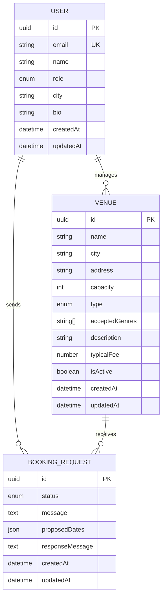

# Connectour API — Module Booking Request

## Status

🚧 **MVP en cours**
- Architecture de base ✅
- Configuration ORM (MikroORM v6) ✅
- Entités métier (User, Venue, BookingRequest) ✅
- Endpoints REST (Venues, BookingRequests, Users) ✅
- Docker Compose (PostgreSQL) ✅
- Validation des entrées (DTOs) ✅
- Authentification JWT 🔄
- Guards par rôle 🔄

---

## Contexte métier

Connectour est une plateforme de mise en relation entre artistes, salles de
concert, tourneurs et organisateurs, née d'un besoin collectif identifié au
sein de la scène des musiques extrêmes (metal, punk, hardcore) de Nantes.

Ce dépôt contient le **module backend Booking Request** : le cœur fonctionnel
de la plateforme, qui permet à un artiste de rechercher des salles selon ses
critères (localisation, capacité, genre musical, période), d'envoyer des
demandes de contact — unitaires ou groupées — et de suivre leur statut jusqu'à
la confirmation ou le refus d'une date.

**Problème métier adressé :**
Aujourd'hui, un artiste peut passer plusieurs heures par semaine à chercher des contacts
sur les réseaux sociaux, envoyer des dizaines de mails sans réponse, et gèrer
les retours de façon chaotique dans sa boîte mail. Ce module vise à ramener
ce temps à moins d'une heure, en centralisant l'ensemble du processus.

**Utilisateurs cibles :**
- Artistes indépendants cherchant à organiser des tournées
- Gestionnaires de salle recevant et traitant les demandes
- Organisateurs bénévoles coordonnant des événements

**Périmètre de ce module (MVP) :**

Ce module couvre :
- La modélisation des entités métier (User, Venue, BookingRequest)
- La recherche filtrée de salles (ville, capacité, genre, période)
- La création de demandes unitaires et groupées
- Le suivi du statut via une machine à états métier
- La documentation des endpoints via Swagger

Ce module ne couvre pas (itérations prévues) :
- L'authentification et la gestion des sessions (JWT / Google SSO)
- La messagerie intégrée entre artistes et salles
- Les notifications automatiques et relances
- La génération de contrats et la signature électronique

---

## Décisions techniques

### NestJS + TypeScript
NestJS s'impose naturellement dans ce contexte : cohérence avec le frontend
React/TypeScript existant, architecture modulaire qui reflète le découpage
métier (un module = un domaine), et écosystème mature bien documenté.
L'utilisation de TypeScript garantit la détection d'erreurs à la compilation
et facilite la collaboration future avec l'équipe.

### MikroORM
Choix motivé par trois raisons complémentaires :
- **Migrations plus robustes** que TypeORM, avec un historique versionné clair
- **Pattern Unit of Work** : les changements sont trackés et persistés en une
  seule transaction, ce qui évite les effets de bord
- **Meilleure DX** : `defineConfig` typé, détection d'erreurs à la config

### PostgreSQL
Base relationnelle adaptée aux relations entre entités (User ↔ Venue ↔
BookingRequest). Le type `jsonb` natif est utilisé pour les `proposedDates`,
ce qui évite une table de jointure supplémentaire pour un besoin simple.

### crypto.randomUUID() natif
Plutôt que d'ajouter une dépendance `uuid`, on utilise l'API `crypto` native
de Node.js 20. Moins de dépendances = moins de surface d'attaque et de
maintenance.

### Authentification — décision MVP
L'authentification est volontairement hors périmètre de ce premier module.
Il s'agit d'un **périmètre MVP défini dès le départ** : l'objectif est de
valider la logique métier du module Booking Request de façon isolée, avant
d'y greffer la couche d'auth. Cette dette technique est identifiée et documentée
— l'ajout de guards JWT ne nécessitera pas de modifier la logique métier, 
seulement d'ajouter une couche de protection sur les endpoints existants.

### Validation des entrées (class-validator + DTOs)
Chaque endpoint valide ses données d'entrée via des classes DTO décorées
(`class-validator`). Le pipe global (`ValidationPipe`) est activé avec :
- **whitelist** : les champs non déclarés dans le DTO sont supprimés silencieusement
- **forbidNonWhitelisted** : les champs inconnus provoquent une erreur 400 explicite
- **transform** : les query params (strings) sont convertis automatiquement en types attendus (number, enum…)

**Justification métier :** un artiste qui remplit un formulaire de demande de
booking doit avoir un retour immédiat si ses données sont incomplètes (pas de
message, pas de salle cible). Côté gestionnaire, on empêche l'injection de
champs non prévus (principe de moindre surprise + sécurité).

### Migration de MikroORM v7 → v6

MikroORM v7.0.0 a été **lancé le 11 mars 2026** — extrêmement récent. Le projet
a initialement tenté d'utiliser cette dernière version, mais une incompatibilité
avec `AsyncLocalStorage` de Node.js a bloqué le démarrage de l'application.

Vu le timing et la nature du bug (requête d'initialisation asynchrone vs APINode.js),
il est probable que les équipes de MikroORM et NestJS n'aient pas eu le temps de
valider complètement la compatibilité cross-stack avant la release.

**Solution adoptée :** downgrade vers **v6.4.15**, version stable et éprouvée qui offre :
- ✅ AsyncLocalStorage supporté nativement
- ✅ CommonJS stable (pas de problèmes ESM)
- ✅ DX optimisée avec `defineConfig` typé

---

## Stack technique

| Élément | Choix | Version |
|---|---|---|
| Runtime | Node.js | 20 |
| Framework | NestJS | 11 |
| Langage | TypeScript | 5 |
| ORM | MikroORM | 6.4 |
| Base de données | PostgreSQL | 17 |
| Documentation API | Swagger (OpenAPI) | — |
| Tests | Jest | — |
| Gestionnaire de paquets | pnpm | — |

---

## Lancer le projet

### Prérequis
- Node.js >= 20
- Docker & Docker Compose (pour PostgreSQL)
- pnpm

### Installation
```bash
# Lancer PostgreSQL via Docker Compose
docker compose up -d

# Installer les dépendances
pnpm install

# Copier et remplir les variables d'environnement
cp .env.example .env
```

### Variables d'environnement

| Variable | Description | Exemple |
|---|---|---|
| `DB_HOST` | Hôte PostgreSQL | `localhost` |
| `DB_PORT` | Port PostgreSQL | `5433` |
| `DB_NAME` | Nom de la base | `connectour_db` |
| `DB_USER` | Utilisateur | `connectour_user` |
| `DB_PASSWORD` | Mot de passe | `***` |
| `NODE_ENV` | Environnement | `development` |
| `PORT` | Port de l'API | `3000` |

### Démarrer
```bash
# Compiler le projet
pnpm build

# Démarrer en développement (hot reload)
pnpm start:dev

# Démarrer en mode debug
pnpm start:debug

# Démarrer en production
pnpm start:prod

# Swagger disponible sur
http://localhost:3000/api
```

### Gestion des migrations
```bash
# Générer une nouvelle migration
pnpm migration:create

# Lancer les migrations
pnpm migration:up

# Revenir sur la migration précédente
pnpm migration:down

# Voir la liste des migrations
pnpm migration:list
```

### Tests
```bash
# Lancer les tests
pnpm test

# En mode watch
pnpm test:watch

# Avec couverture
pnpm test:cov

# Tests E2E
pnpm test:e2e
```

---

## Architecture du projet
```
src/
├── users/                  # Domaine utilisateur
│   ├── user.entity.ts
│   ├── user.module.ts
│   ├── user.service.ts
│   ├── user.controller.ts
│   └── dto/
│       ├── create-user.dto.ts
│       └── update-user.dto.ts
├── venues/                 # Domaine salle de concert
│   ├── venue.entity.ts
│   ├── venue.module.ts
│   ├── venue.service.ts
│   ├── venue.service.spec.ts
│   ├── venue.controller.ts
│   └── dto/
│       ├── create-venue.dto.ts
│       └── search-venues.dto.ts
├── booking-requests/       # Domaine principal — demandes de contact
│   ├── booking-request.entity.ts
│   ├── booking-request.module.ts
│   ├── booking-request.service.ts
│   ├── booking-request.service.spec.ts
│   ├── booking-request.controller.ts
│   └── dto/
│       ├── create-booking-request.dto.ts
│       └── update-status.dto.ts
├── migrations/             # Historique des migrations MikroORM
├── mikro-orm.config.ts     # Configuration ORM
├── app.module.ts           # Module racine
└── main.ts                 # Point d'entrée
```

---

## Exemple — Créer une première entité

MikroORM utilise des décorateurs TypeScript pour mapper les entités.
Voici un exemple simplifié d'une entité `User` :

```typescript
import { Entity, PrimaryKey, Property } from '@mikro-orm/core';

@Entity()
export class User {
  @PrimaryKey()
  id: string = crypto.randomUUID();

  @Property()
  email!: string;

  @Property()
  name!: string;

  @Property({ type: 'date', nullable: true })
  createdAt = new Date();
}
```

**Points clés :**
- `@Entity()` : Marque la classe comme entité MikroORM
- `@PrimaryKey()` : Clé primaire (ici UUID natif)
- `@Property()` : Propriétés mappées en colonnes
- `!` : Propriété obligatoire (typage strict TypeScript)

Une fois définie et compilée, MikroORM la découvrira automatiquement via le
chemin configuré dans `mikro-orm.config.ts` : `['dist/**/*.entity.js']`

---

## Modèle Conceptuel de Données (MCD)



---

## Machine à états — BookingRequest

Le statut d'une demande suit une machine à états stricte,
validée côté service indépendamment du frontend :
```
PENDING ──→ VIEWED ──→ NEGOTIATING ──→ CONFIRMED
   │                        │
   └──→ CANCELLED       REFUSED
        (artiste)      (gestionnaire)
```

---
